# uniapp-rabbit

## 目录

- [uniapp-rabbit](#uniapp-rabbit)
  - [目录](#目录)
  - [day1](#day1)
    - [使用 vuecli 创建 uniapp项目](#使用-vuecli-创建-uniapp项目)
    - [运行和预览uniapp项目](#运行和预览uniapp项目)
    - [开发的规范](#开发的规范)
    - [项目目录结构](#项目目录结构)
    - [uniapp生命周期](#uniapp生命周期)
    - [开发的注意事项](#开发的注意事项)
    - [开发的规范小结：  ](#开发的规范小结--)
    - [uniapp的api](#uniapp的api)
    - [easycom](#easycom)
    - [引入和使用 uni-ui](#引入和使用-uni-ui)
    - [引入和使用 vuex](#引入和使用-vuex)
  - [day2](#day2)
    - [小兔仙项目介绍 - 6](#小兔仙项目介绍---6)
    - [运行小兔鲜项目](#运行小兔鲜项目)
    - [项目准备 - 为@添加代码提示和插件](#项目准备---为添加代码提示和插件)
    - [vuex-复习-state和getters的使用-8](#vuex-复习-state和getters的使用-8)
    - [vuex-复习-mutations](#vuex-复习-mutations)
    - [vuex-复习-actions](#vuex-复习-actions)
    - [引进和使用vuex的持久化](#引进和使用vuex的持久化)
    - [添加拦截器 - 课程md复制即可](#添加拦截器---课程md复制即可)
    - [测试拦截器](#测试拦截器)
    - [tabbar搭建](#tabbar搭建)
    - [自定义导航栏](#自定义导航栏)
    - [安全区域 - top代表安全区域起点](#安全区域---top代表安全区域起点)
    - [胶囊的安全区域 - top代表胶囊安全区域起点](#胶囊的安全区域---top代表胶囊安全区域起点)
    - [使用vuex完成顶部导航栏](#使用vuex完成顶部导航栏)
    - [获取主页的banners](#获取主页的banners)
    - [banner高度设置](#banner高度设置)
    - [分类栏目](#分类栏目)
    - [栏目的滑动效果](#栏目的滑动效果)
    - [人气推荐](#人气推荐)
    - [页面滚动](#页面滚动)
    - [新鲜好物和热门品牌](#新鲜好物和热门品牌)
    - [猜你喜欢-列表正常渲染](#猜你喜欢-列表正常渲染)
    - [接口小建议](#接口小建议)
    - [猜你喜欢 - 分页](#猜你喜欢---分页)
    - [优化- 添加节流-6](#优化--添加节流-6)
    - [用户底部反馈-6](#用户底部反馈-6)
  - [day3](#day3)
    - [下拉刷新-10](#下拉刷新-10)
    - [下拉刷新状态](#下拉刷新状态)
    - [补充-Promise.all](#补充-promiseall)
    - [下拉刷新完成-注意async会把函数返回值直接变为 promise对象](#下拉刷新完成-注意async会把函数返回值直接变为-promise对象)
    - [推荐页面静态结构-全部在文档CV](#推荐页面静态结构-全部在文档cv)
    - [动态设置页面标题](#动态设置页面标题)
    - [获取当前页面的数据](#获取当前页面的数据)
    - [~~数据加工处理-解决返回数据无法直接遍历 - 后台接口已改，不用再处理~~](#数据加工处理-解决返回数据无法直接遍历---后台接口已改不用再处理)
    - [页面数据渲染-12](#页面数据渲染-12)
    - [推荐的分页请求](#推荐的分页请求)
    - [数据追加](#数据追加)
    - [优化 - 节流](#优化---节流)
    - [优化 - 用户底部](#优化---用户底部)
    - [分类-渲染一级分类](#分类-渲染一级分类)
    - [分类-轮播图](#分类-轮播图)
    - [二级分类渲染](#二级分类渲染)
    - [我的模块](#我的模块)
    - [我的模块其他模块](#我的模块其他模块)
    - [使用小程序自带方法获取加密手机号](#使用小程序自带方法获取加密手机号)
    - [通过wx.login获取用户code](#通过wxlogin获取用户code)
  - [day4](#day4)
    - [完成手机号登录](#完成手机号登录)
    - [手机号模拟登录 - 可以看到登录效果](#手机号模拟登录---可以看到登录效果)
    - [将登陆移植到vuex](#将登陆移植到vuex)
    - [登录成功-返回上一页，显示用户数据](#登录成功-返回上一页显示用户数据)
    - [修改个人信息静态结构-6](#修改个人信息静态结构-6)
    - [获取个人信息-token处理 - 7](#获取个人信息-token处理---7)
    - [修改个人信息页面 - onLoad 改成 onShow](#修改个人信息页面---onload-改成-onshow)
    - [修改个人信息 - 选择个人头像](#修改个人信息---选择个人头像)
    - [修改个人信息 - 修改个人头像 - 13](#修改个人信息---修改个人头像---13)
    - [修改个人信息 - 昵称性别出生](#修改个人信息---昵称性别出生)
    - [使用dayjs完成日期格式化](#使用dayjs完成日期格式化)
    - [修改个人信息 - 地址选择](#修改个人信息---地址选择)
    - [修改个人信息](#修改个人信息)
    - [我的页面同步信息](#我的页面同步信息)
    - [账号管理-静态结构](#账号管理-静态结构)
    - [地址管理-静态结构](#地址管理-静态结构)
    - [新建地址 - 静态结构和数据分析](#新建地址---静态结构和数据分析)
    - [新建地址完成 - 12](#新建地址完成---12)
    - [收货地址列表渲染](#收货地址列表渲染)
  - [day5](#day5)
    - [收货地址修改](#收货地址修改)
    - [删除收货地址](#删除收货地址)
    - [商品详情-介绍和页面静态结构](#商品详情-介绍和页面静态结构)
    - [自定义返回按钮](#自定义返回按钮)
    - [获取商品详情数据](#获取商品详情数据)
    - [轮播图 ](#轮播图-)
    - [规格参数](#规格参数)
    - [商品评价、商品详情、常见问题 ](#商品评价商品详情常见问题-)
    - [商品详情整页面cv](#商品详情整页面cv)
    - [商品详情-相关推荐和用户操作](#商品详情-相关推荐和用户操作)
    - [商品详情-弹出层-对应4个小组件](#商品详情-弹出层-对应4个小组件)
    - [弹出层实现](#弹出层实现)
    - [sku概念-最小库存单位](#sku概念-最小库存单位)
    - [sku算法了解 - 2018阿里面试题 - 原理讲出来就可以进阿里了](#sku算法了解---2018阿里面试题---原理讲出来就可以进阿里了)
    - [sku插件下载和引用](#sku插件下载和引用)
    - [sku关键属性介绍](#sku关键属性介绍)
    - [sku复制官网demo看效果](#sku复制官网demo看效果)
    - [官网demo数据和后台数据一一对应](#官网demo数据和后台数据一一对应)
    - [根据官网文档，把后台数据处理成合适的数据](#根据官网文档把后台数据处理成合适的数据)
    - [完善商品sku的三个小功能](#完善商品sku的三个小功能)
    - [加入购物车](#加入购物车)
  - [day6](#day6)
    - [对象解构和重命名](#对象解构和重命名)
    - [跳转购物车 - 跳转tabbar 使用 switchTab](#跳转购物车---跳转tabbar-使用-switchtab)
    - [购物车列表和登录状态](#购物车列表和登录状态)
    - [未登录状态下会跳转登录页的处理](#未登录状态下会跳转登录页的处理)
    - [商品状态的修改](#商品状态的修改)
    - [商品数量的修改](#商品数量的修改)
    - [使用uniapp内置组件完成数量修改 ](#使用uniapp内置组件完成数量修改-)
    - [勾选商品的总数量和总价格 ](#勾选商品的总数量和总价格-)
    - [计算全选状态](#计算全选状态)
    - [全选和反选 ](#全选和反选-)
    - [删除商品 ](#删除商品-)
    - [批量删除商品](#批量删除商品)
    - [跳转订单页](#跳转订单页)
    - [预付单 - 发送请求拿回数据](#预付单---发送请求拿回数据)
    - [订单 - 获取收货地址，存放到vuex-13](#订单---获取收货地址存放到vuex-13)
    - [地址选择-返回上一页的优化](#地址选择-返回上一页的优化)
    - [创建预付单](#创建预付单)
    - [跳转订单详情页-带上orderId](#跳转订单详情页-带上orderid)
    - [购物车立即下单跳转预付单-8](#购物车立即下单跳转预付单-8)
    - [订单-顶部导航栏-获取设备平台](#订单-顶部导航栏-获取设备平台)
    - [获取订单详情](#获取订单详情)
    - [订单状态渲染](#订单状态渲染)
    - [时间格式化](#时间格式化)
    - [倒计时](#倒计时)
    - [支付功能实现](#支付功能实现)
    - [订单状态，订单列表在md文档复制完成 ](#订单状态订单列表在md文档复制完成-)
  - [扩展](#扩展)
    - [uniapp - hbuildx](#uniapp---hbuildx)
    - [新建项目](#新建项目)
    - [运行项目](#运行项目)
    - [运行时可能出现的问题](#运行时可能出现的问题)
    - [打包项目](#打包项目)
    - [打包可能出现的问题](#打包可能出现的问题)

## day1

### 使用 vuecli 创建 uniapp项目

1.  node版本16，然后安装全局vue/cli\@4.5.19,千万不要用第5版
2.  脚手架创建项目，vue create -p dcloudio/uni-preset-vue my-project
3.  如果是首次创建，选择"默认模板即可"

### 运行和预览uniapp项目

1.  在 manifest.json填入appid
2.  运行 npm run dev:mp-weixin
3.  开发者工具，导入项目，注意路径 "项目地址/dist/dev/mp-weixin"

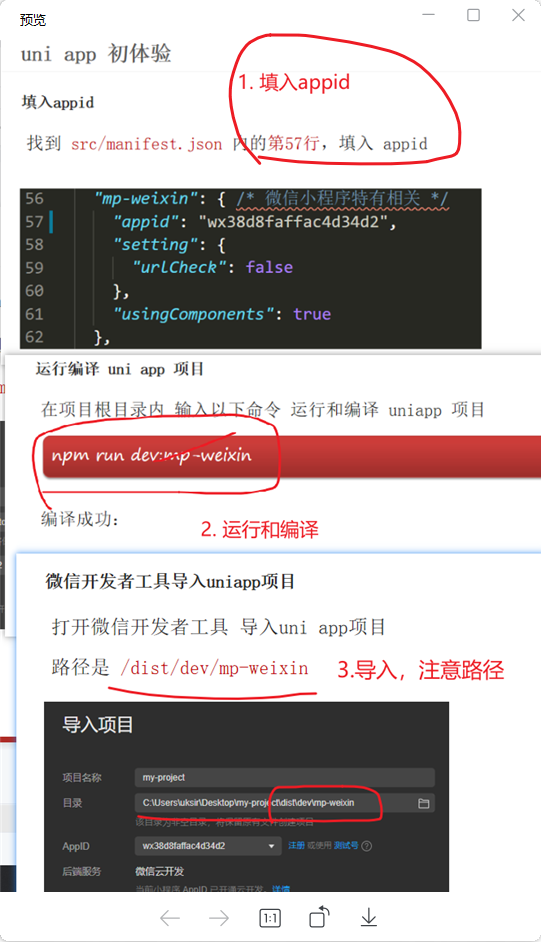
<!--  -->

### 开发的规范

1.  不能直接在开发者工具中修改代码，口诀：vscode做开发，开发者工具做调试
2.  标签使用小程序的规范，语法使用vue的即可

### 项目目录结构

1.  App.vue 相等于原生小程序 app.wxss （全局样式文件）和 app.js （应用入口文件）
2.  main.js uniapp 项目入口文件 ，后期有一些设置想全局都生效(vuex)
3.  mainifest.json 相当于小程序 project.config.json 设置 appid 、设置不校验合法域名一微信开发者工具一本地设置的功能
4.  pages.json 相当于以前小程序当中全局配置 app.json 和页面配置 index.json
    1.  新建了页面，需要在 pages.json 中设置页面路径
    2.  设置应用的标题还可以设置单个页面的标题
    3.  设置导航栏样式
    4.  设置 tabbar
5.  uni.scss 全局样式文件，写 scss 语法，默认被 uniapp 引入了，所以不需要手动去引入它
6.  pages 文件夹是否 uniapp 页面文件！！
7.  static 存放静态资源，图片，字体等

### uniapp生命周期

口诀：组件生命周期使用vue规范，其他使用小程序规范

1.  应用生命周期，使用小程序
    1.  onLauch等
2.  页面生命周期，使用小程序
    1.  onLoad，onShow等
3.  组件生命周期，使用vue的规范
    1.  created，mounted等

### 开发的注意事项

1. 不要再微信开发者工具中，做任何的修改(包括页面的创建app.json,修改appid) &#x20;

2. 保证vscode的项目时，是有启动服务的 &#x20;

&#x20;

### 开发的规范小结： &#x20;

1. 标签和应用、页面生命周期，使用小程序规范(view,text,onLoad,onShow) &#x20;

2. 语法和组件的生命周期，使用vue2的语法规范(@clik, mounted)

### uniapp的api

1.  wx的api，修改前缀后(uni)，可以直接用 : wx.showToast() ---- uni.showToast()
2.  uni支持promise的使用方式
    1.  ~~使用promise返回的是数组，建议直接解构使用即可(新版本对返回的数据做了封装，不一定是数组)~~

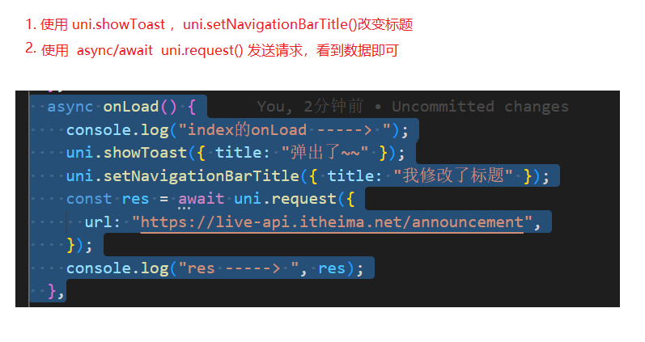

### easycom

1.  按照规范新建组件： components/组件名/组件名.vue
2.  页面直接使用即可


### 引入和使用 uni-ui

官网：

1.  根目录创建vue.config.js 配置需要编译 uni-ui

```javascript
// vue.config.js
module.exports = {
    transpileDependencies:['@dcloudio/uni-ui']
}
```

1.  安装 npm i sass @dcloudio/uni-ui
2.  配置easycom，方便整个项目都能使用到 uni-ui
3.  页面复制代码使用 提示： 因为改过配置，一般都要重新启动项目

到了这里，基本语法已经介绍完毕，可以进入项目

### 引入和使用 vuex

uniapp官网:[https://uniapp.dcloud.net.cn/tutorial/vue3-vuex.html#状态管理vuex](https://uniapp.dcloud.net.cn/tutorial/vue3-vuex.html#状态管理vuex "https://uniapp.dcloud.net.cn/tutorial/vue3-vuex.html#状态管理vuex")

1.  安装vuex
2.  新建文件 `src/store/index.js`
3.  `src/main.js` 中 引入 `store`
4.  页面引入使用

```javascript
// 页面路径：store/index.js
import Vue from "vue";
import Vuex from "vuex";

Vue.use(Vuex); //vue的插件机制
//Vuex.Store 构造器选项
const store = new Vuex.Store({
  state: {username:'zs'},
  getters: {},
  modules: {},
});
export default store;

// src/main.js 中 引入 store
import store from "./store";
const app = new Vue({
  store,
  ...App,
});

import { mapState } from 'vuex';
  computed: {
    ...mapState(['username']),
  },
<template>
  <view class="content">
    {{ username }}
  </view>
</template>

```

## day2

### 小兔仙项目介绍 - 6

与md文档一致

### 运行小兔鲜项目

1.  把老师发的"小兔鲜项目代码-项目结构"代码复制
2.  进入项目，安装依赖
3.  在 manifest.json(大概57行)修改自己的 appid
4.  运行 npm run dev:mp-weixin
5.  开发者工具中，导入项目（不选择云服务），注意路径是 项目地址/dist/dev/mp-weixin
6.  能看到导航条出来就ok
7.  未雨绸缪：npm i vuex和 npm i vuex-uniapp-persistence


### 项目准备 - 为@添加代码提示和插件

与md文档一致

### vuex-复习-state和getters的使用-8

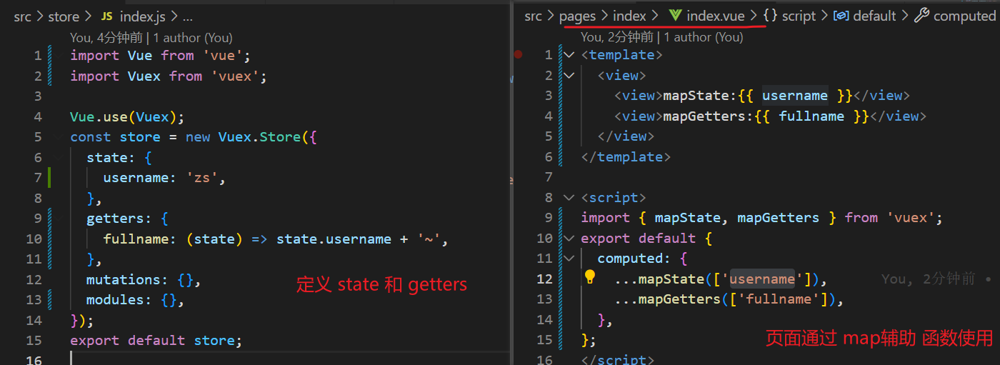

### vuex-复习-mutations

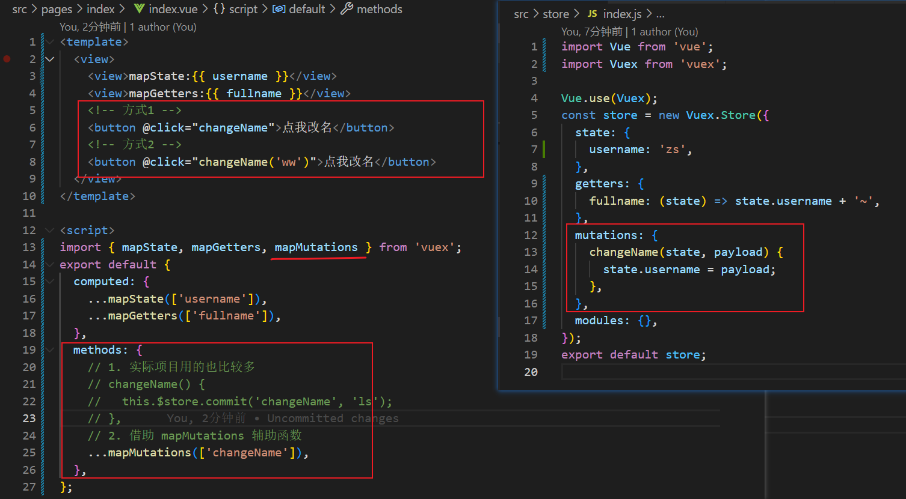

### vuex-复习-actions

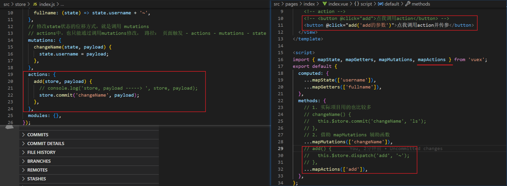

### 引进和使用vuex的持久化

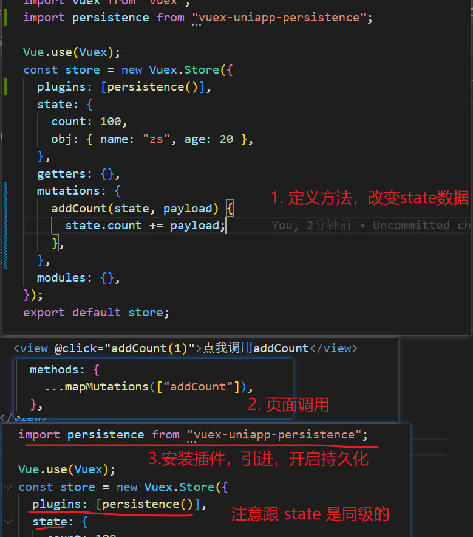

### 添加拦截器 - 课程md复制即可

官网:[https://uniapp.dcloud.net.cn/api/interceptor.html](https://uniapp.dcloud.net.cn/api/interceptor.html "https://uniapp.dcloud.net.cn/api/interceptor.html")

### 测试拦截器

1.  引进封装请求的方法
2.  onload中调用，看到返回的数据即可

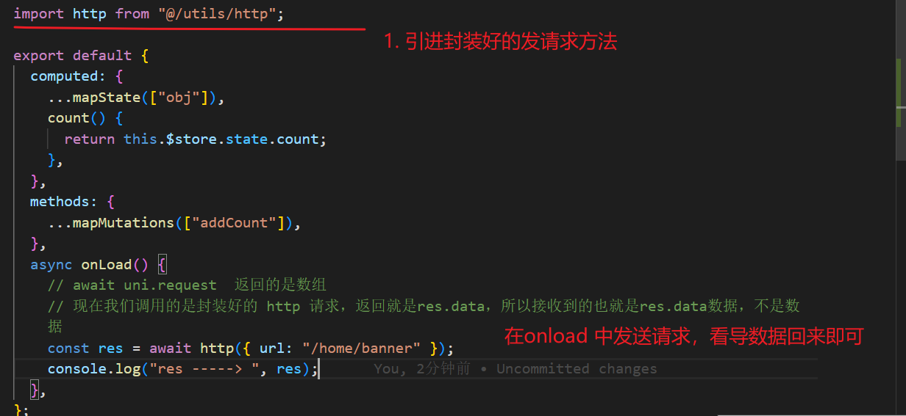

### tabbar搭建

1.  可以直接在官网上搜索 tabbar，或者路径在 官网-全局文件-页面配置pages.json-tabbar
2.  找到实例代码，修改即可

### 自定义导航栏

1.  自定义导航栏
2.  页面引进和使用


### 安全区域 - top代表安全区域起点

1.  uni.getWindowInfo() 同步获取到设备的信息，其中safeArea代表安全区域

```javascript
  mounted() {
    // 同步返回，getWindowInfo
    const safeArea = uni.getWindowInfo().safeArea;
    this.safeArea = safeArea;
  },
```

1.  页面上保存数据，并且在标签中绑定样式，从而确定安全高度即可

```javascript
  data() {
    return {
      safeArea: null,
    };
  },
```

1.  标签绑定样式

```javascript
<view class="nav" :style="{ height: safeArea.top + 'px' }">我是自定义导航栏</view>
```


### 胶囊的安全区域 - top代表胶囊安全区域起点

1.uni.getMenuButtonBoundingClientRect() 同步获取到设备的信息

```javascript
    // 胶囊的安全区域
    const jiaonang = uni.getMenuButtonBoundingClientRect();
    // console.log("胶囊的安全区域 -----> ", jiaonang);
    this.jiaonang = jiaonang;
```

1.  页面上保存数据，并且在标签中绑定样式，从而确定安全高度即可

```javascript
  data() {
    return {
      safeArea: null,
      jiaonang: null,
    };
  },
```

1.  标签绑定样式

```javascript
    <view class="jiaonang" :style="{ height: jiaonang.top + 'px' }"
      >我是胶囊的安全区域</view
    >
    <view class="jiaonangBGC" :style="{ height: jiaonang.height + 'px' }"
      >胶囊的背景色</view
    >
    
    <style>
    .nav {
      background-color: greenyellow;
    }
    .jiaonang {
      background-color: red;
    }
    .jiaonangBGC {
      background-color: pink;
    }
    </style>
```


### 使用vuex完成顶部导航栏

&#x20; 0\. Navbar.vue静态文档cv

1.  获取两个安全区域并且存到vuex

```javascript
  // store/index.js
  state: {
    // 导航栏的安全区域
    safeArea: uni.getWindowInfo().safeArea,
    // 胶囊的安全区域
    capsule: uni.getMenuButtonBoundingClientRect(),
  },
```

1.  页面中引入数据，并且渲染到页面上

```javascript
// src\pages\index\components\Navbar.vue
<view class="navbar" :style="{ paddingTop: safeArea.top + 'px' }">

import { mapState } from "vuex";
export default {
  computed: {
    ...mapState(["safeArea", "capsule"]),
  },
};

```


### 获取主页的banners

1.  把页面对应的请求，放在对应文件里面，方便维护 @/api/home

```javascript
//src\api\home.js
import http from "@/utils/http";

// 首页-广告区域-小程序
export const getHomeBanner = (distributionSite = 1) => {
  return http({
    url: "/home/banner",
    data: {
      distributionSite,
    },
  });
};
```

1.  页面引进并且调用

```javascript
    //src\pages\index\index.vue
    // 引入全局组件和调用方法
    <Carousel :banners="banners"></Carousel>
    
    import { getHomeBanner } from "@/api/home";
      
    data() {
      return {
        banners: [],
      };
    },
    async onLoad() {
      this.getHomeBanner();
    },
    methods: {
      async getHomeBanner() {
        const res = await getHomeBanner();
        this.banners = res.result;
      },
    },
```

1.  静态组件接收数据和渲染(高度先不管)

```javascript
<template>
  <swiper class="carousel" autoplay indicator-dots circular>
    <swiper-item v-for="item in banners" :key="item.id">
      <image :src="item.imgUrl"></image>
    </swiper-item>
  </swiper>
</template>

<script>
export default {
  props: ['banners'],
};
</script>
```


### banner高度设置

原理就是 设计稿的转换&#x20;

375px  ---->  750rpx
1px   -----> 2rpx
140px ------> 280rpx，传递这个到轮播图组件即可

```javascript
 //  src\pages\index\index.vue
<Carousel :banners="banners" height="280rpx"></Carousel>
```

```javascript
 //  src\components\Carousel\Carousel.vue
  <swiper
    class="carousel"
    :style="{ height }"
    autoplay
    indicator-dots
    circular
  >
```

### 分类栏目

-   JSDoc注释，输入为  / \*\*，利用代码补全即可

1.  在 api/home.js 封装请求

```javascript
/**
 * 首页-前台分类-小程序
 */
export const getHomeCategoryMutli = () => {
  return http({
    url: "/home/category/mutli",
  });
};
```

1.  页面调用请求获取类目数据

```javascript
import { getHomeBanner, getHomeCategoryMutli } from "@/api/home";
  async onLoad() {
    this.getHomeBanner();
    this.getHomeCategoryMutli();
  },
  methods: {
    async getHomeBanner() {
      const res = await getHomeBanner();
      this.banners = res.result;
    },
    async getHomeCategoryMutli() {
      const res = await getHomeCategoryMutli();
      this.categoryHeadMutli = res.result;
    },
  },

```

1.  传递数据，CateScroll 做渲染

```javascript
<CateScroll :categoryHeadMutli="categoryHeadMutli"></CateScroll>
```

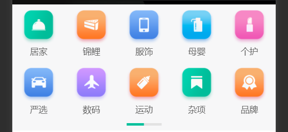

### 栏目的滑动效果

1.  介绍UI组件 scroll-view scroll-x @scroll="handleCategory"
2.  方法里打印e，拿到栏目滑动距离
3.  通过safeArea 获取当前屏幕宽度
4.  距离 / 宽度拿到比例
5.  设置在 translateX(比例)

```javascript
// src\components\CateScroll\CateScroll.vue
  import { mapState } from "vuex";
  computed: {
    ...mapState(["safeArea"]),
  },
  methods: {
    // 滚动时触发的回调
    handleCategory(e) {
      //   e.detail.scrollLeft 拿到的就是水平的滚动距离
      //   整个设备的宽度可以从 安全区域 safeArea 拿到
      //   console.log(this.safeArea.width);
      const rate = (e.detail.scrollLeft / this.safeArea.width) * 100 + "%";
      this.scrollLeft = rate;
    },
  },
```


### 人气推荐

1.  封装请求
2.  页面发送请求
3.  数据渲染

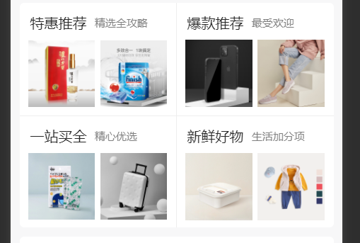

### 页面滚动

记得把首页模块的样式cv过来啊！！！


```javascript
<template>
  <view class="content">
    <!-- 1.自定义导航 -->
    <Navbar></Navbar>
    <scroll-view scroll-y class="main">
      <!-- 2.轮播图 -->
      <!-- 3.分类栏目 -->
      <!-- 4. 人气推荐 -->
      <!-- 5. 新鲜好物 -->
    </scroll-view>
  </view>
</template>
```

### 新鲜好物和热门品牌

发送请求，拿回数据，页面渲染


### 猜你喜欢-列表正常渲染

1.  介绍猜你喜欢有3部分功能，1正常渲染，2下拉加载，3上拉刷新
2.  完成1正常渲染即可
    1.  封装api请求
    2.  发送请求，提醒返回数据在 res.result.items
    3.  为分页做好准备，定义好分类数据this.guessParams = {page: 1,pageSize: 10};
    4.  看到传递的参数，和返回数据即可，页面内容渲染
    ```javascript
      //  src\pages\index\index.vue
      <!-- 猜你喜欢 -->
      <Guess :homeGoodsGuessLike="homeGoodsGuessLike"></Guess>
     
      data() {
        return {
          //   猜你喜欢
          homeGoodsGuessLike: [],
        };
      },
      async onLoad() {
        // 猜你喜欢的分页数据
        this.guessParams = { page: 1, pageSize: 10 };
        // 猜你喜欢
        this.getHomeGoodsGuessLike();
      },
      
      methods: {
        async getHomeGoodsGuessLike() {
          const res = await getHomeGoodsGuessLike(this.guessParams);
          this.homeGoodsGuessLike = res.result.items;
        },
      },
    ```

### 接口小建议

1.  为什么不在data定义guessParams，因为我不希望guessParams改变时，页面也更新

### 猜你喜欢 - 分页

1.  找到组件 scroll-view 滑到底部的api，触发方法 - @scrolltolower
2.  在方法里，检查是否还有下一页的数据 - 当前页数 < 后台告知的总页数
    1.  有的话，页码加1，page++，发送请求
    2.  数据回来，要追加

```vue

  <!-- 
      scroll-y    允许垂直滑动
      @scrolltolower 滑动到底部触发的事件
   -->
   <scroll-view scroll-y class="main" @scrolltolower="scrolltolower">


  async onLoad() {
    // 猜你喜欢总页数，由后台小哥告诉我
    this.pages = 1;
    // 猜你喜欢的分页数据
    this.guessParams = { page: 1, pageSize: 10 };
    // 猜你喜欢
    this.getHomeGoodsGuessLike();
  },
  methods: {
    async getHomeGoodsGuessLike() {
      const res = await getHomeGoodsGuessLike(this.guessParams);
      //   这里要改一下，改成数据追加
      //   this.homeGoodsGuessLike = res.result.items;
      //   改成数据追加
      this.homeGoodsGuessLike = [
        ...this.homeGoodsGuessLike,
        ...res.result.items,
      ];
      this.pages = res.result.pages;
    },
    scrolltolower(e) {
      console.log("我已经滚到底部了，不要再滚了 -----> ", e);
      //   是否还有下一页的数据，当前页数 < 后台告知的总页数
      if (this.guessParams.page < this.guessPages) {
        // 页码+1，发送请求，数据回来追加进去
        this.guessParams.page++;
        this.getHomeGoodsGuessLike();
      }
    },
  },

```

### 优化- 添加节流-6

1.  触底时，检测是否有请求在发送中 - 可以通过 loading 控制
2.  有的话，就不要再发
3.  没有的话，设置 loading 为true，发送请求，请求回来，设置为false

```javascript

    async scrolltolower(e) {
      /* 
        优化- 添加节流
        1. 触底时，检测是否有请求在发送中 - 可以通过 loading 控制
        2. 有的话，就不要再发
        3. 没有的话，设置 loading 为true，发送请求，请求回来，设置为false
        */
      if (this.loading) {
        return;
      }
      if (this.guessParams.page < this.guessPages) {
        this.guessParams.page++;
        this.loading = true;
        await this.getHomeGoodsGuessLike();
        this.loading = false;
      }
    },
```

### 用户底部反馈-6

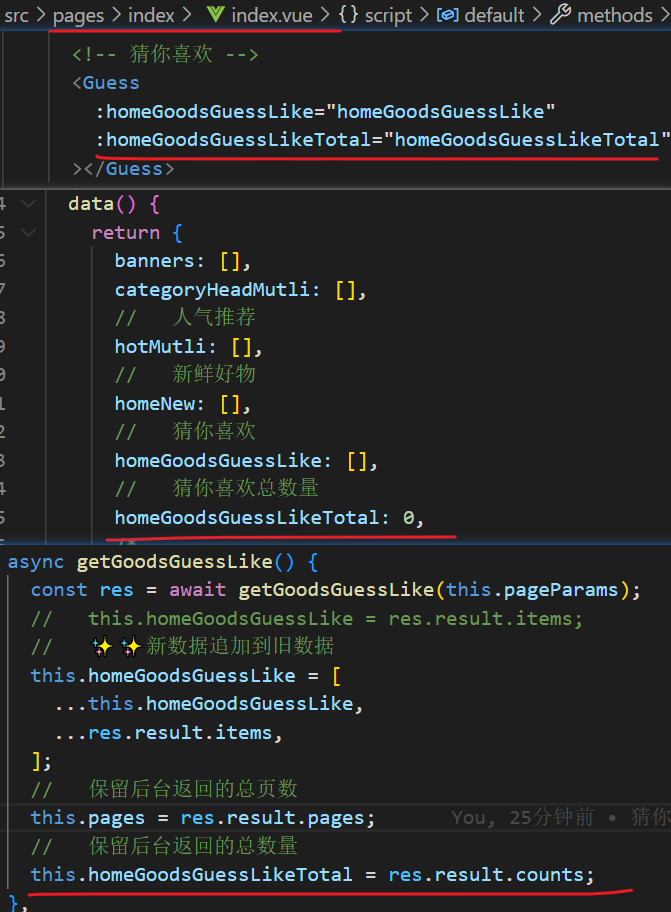

## day3

### 下拉刷新-10

1.  查阅scroll-view的api，开启允许下拉刷新refresher-enabled和绑定下拉刷新事件refresherrefresh
2.  数据处理
    1.  清空旧数据 - data中的数据，页码数据
    2.  发送请求，拿回新数据

```vue
    //src\pages\index\index.vue
    
    <scroll-view
      scroll-y
      class="main"
      @scrolltolower="scrolltolower"
      refresher-enabled
      @refresherrefresh="refresherrefresh"
    >
    
    refresherrefresh(e) {
      /*
            下拉刷新
            1. 查阅api，开启允许下拉刷新refresher-enabled和绑定下拉刷新事件refresherrefresh
            2. 数据处理
                2.1 清空旧数据 - data中的数据，页码数据
                2.2 发送请求，拿回新数据
        */
      //   console.log("下拉刷新~", e);
      this.banners = [];
      this.categoryHeadMutli = [];
      this.hotMutli = [];
      this.homeNew = [];
      this.homeGoodsGuessLike = [];
      this.homeGoodsGuessLikeTotal = 0;

      this.pages = 1;
      this.loading = false;
      this.pageParams = { page: 1, pageSize: 20 };

      this.getHomeBanner();
      this.getHomeCategoryMutli();
      this.getHomeHotMutli();
      this.getHomeNew();
      this.getHomeGoodsGuessLike();
    },
```

### 下拉刷新状态

1.  查阅文档refresherTriggered可以设置当前下拉刷新状态
2.  一进入下拉刷新，就把状态设置为true，数据都回来了，就设置为false

```javascript
  <scroll-view :refresher-triggered="refresherTriggered" >
    
  data() {
    return {
      // refresherTriggered当前下拉刷新的状态
      refresherTriggered: false,
    };
  },
  methods: {
    // 一进入下拉刷新，就把状态设置为true，数据都回来了，就设置为false
    refresherrefresh(e) {
      this.refresherTriggered = true;
      setTimeout(() => {
        this.refresherTriggered = false;
      }, 3000);
    }
  }
    
```

### 补充-Promise.all

Promise.all,可以一次发送所有的请求，请求都回来之后，才进入回调

可以避免每一个请求都在等待的问题

语法： Promise.all(\[promise1,promise2,promiseN]).then()

```javascript
    <script>
      /* 
            Promise.all,可以一次发送所有的请求，请求都回来之后，才进入回调
            可以避免每一个请求都在等待的问题
            语法： Promise.all([promise1,promise2,promiseN]).then()
        */
      function fn1() {
        return new Promise((resolve, reject) => {
          setTimeout(() => {
            console.log("fn1，1秒完成");
            resolve();
          }, 1000);
        });
      }
      function fn2() { //和fn1 类似 }
      function fn3() { //和fn1 类似 }
      console.time();
      //   记得要调用 fn1(),fn2(),fn3()
      Promise.all([fn1(), fn2(), fn3()]).then(() => {
        console.log("所有请求都完成了");
        console.timeEnd();
      });
    </script>
```

### 下拉刷新完成-注意async会把函数返回值直接变为 promise对象

1.  async，会自动把返回的数据变成 promise
2.  项目中使用promise.all 完成下拉刷新即可

```javascript

    async refresherrefresh(e) {
      this.refresherTriggered = true;

      this.banners = [];
      this.categoryHeadMutli = [];
      this.hotMutli = [];
      this.homeNew = [];
      this.homeGoodsGuessLike = [];

      this.loading = false;
      this.guessPages = 1;
      this.guessParams = { page: 1, pageSize: 10 };

      Promise.all([
        this.getHomeBanner(),
        this.getHomeCategoryMutli(),
        this.getHomeHotMutli(),
        this.getHomeNew(),
        this.getHomeGoodsGuessLike(),
      ]).then(() => {
        this.refresherTriggered = false;
      });
    },
  },
```

### 推荐页面静态结构-全部在文档CV

1.  静态style复制
2.  onLoad中写死 urlMap对象
3.  data中完成页面状态
4.  静态template结构cv

### 动态设置页面标题

1.  从首页过来，带有参数type，与urlMap其实一一对应，拿到urlMap\[type]的数据
2.  动态设置标题uni.setNavigationBarTitle({ title: this.currentItem.title })

```javascript
  //   onLoad 中才可以拿到页面参数
  onLoad({ type }) {
    // 准备好标题和对应的请求地址
    const urlMap = {
      1: { title: "特惠推荐", url: "/home/preference/mutli" },
      2: { title: "爆款推荐", url: "/home/inVogue/mutli" },
      3: { title: "一站买全", url: "/home/oneStop/mutli" },
      4: { title: "领券中心", url: "/home/new/mutli" }, // 后端未提供，暂用新鲜好物url
      5: { title: "新鲜好物", url: "/home/new/mutli" },
    };
    // console.log("urlMap -----> ", urlMap[type]);
    uni.setNavigationBarTitle({ title: urlMap[type].title });
  },
```

### 获取当前页面的数据

1.  因为url在urlMap中一一对应，所以封装api时，需要把url传递过去，接口的参数字段都一样，传递data即可
2.  页面 onLoad 中发送请求 const res = await getHomeRecommend(this.currentItem.url)，参数中subType代表当前tab的id，但是首次进入，并没有id，所以可以不传，
3.  看到返回的数据，里面有subTypes，下次点击时候，把id带过去即可&#x20;

```javascript
// src/api/home.js
/**
 * 人气推荐
 * @param {string} url 请求url
 * @param {object} data 请求数据 - subType-类型id，page-页码，pageSize-数量
*/
export const getHomeRecommend = (url, data) => {
  return http({
    url,
    data,
  });
};
    
//src/pages/recommend/index.vue
import { getHomeRecommend } from "@/api/home";
  onLoad({ type }) {
    const urlMap = {
      1: { title: '特惠推荐', url: '/hot/preference' },
      2: { title: '爆款推荐', url: '/hot/inVogue' },
      3: { title: '一站买全', url: '/hot/oneStop' },
      4: { title: '领券中心', url: '/hot/new' }, // 后端未提供，暂用新鲜好物url
      5: { title: '新鲜好物', url: '/hot/new' },
    };
    this.current = urlMap[type];
    // console.log('this.current -----> ', this.current);
    uni.setNavigationBarTitle({ title: this.current.title });
    this.getHomeRecommend();
  },

```

### ~~数据加工处理-解决返回数据无法直接遍历 - 后台接口已改，不用再处理~~

```javascript
  // 对返回的数据做处理
  this.recommendList = res.result.subTypes.map((v) => ({
    id: v.id,
    title: v.title,
    goodsItems: res.result.goodsItems[v.id],
  }));
  console.log("this.recommendList -----> ", this.recommendList);
```


### 页面数据渲染-12

1.  实现轮播图
2.  实现tab栏目
3.  实现tab栏对应的商品列表渲染

其中要改的数据和绑定的方法自己完成，看到效果即可，上拉分页下节课讲

```javascript
// template在文档自行复制,注意栏目的 {{ item.subTypes.title }} 要改 {{ item.title }}
// 遍历的数据是 recommendList 和 item.goodsItems.items

  async onLoad({ type }) {
    this.bannerPicture = res.result.bannerPicture;
    this.recommendList = res.result.subTypes
  },
  methods: {
    changeTabs(index) {
      this.activeIndex = index;
    },
  },
```

### 推荐的分页请求

1.  开启 scroll-view 竖直方向的滚动 scroll-y ，

    并且绑定滚动到底部的api - @scrolltolower
2.  拿到发送请求需要的参数, 栏目的id,当前页数page,后台的总页数pages
3.  判断后台是否还有数据  当前页数page < 后台的总页数pages
    1.  页码+1，发送请求
    2.  数据回来，追加到数组中
    3.  优化 - 节流，用户体验

```javascript
     // 方法里面接收参数 data
     async getHomeRecommend(data) {
      const res = await getHomeRecommend(this.current.url, data);
      console.log('getHomeRecommend -----> ', res);
      //   轮播图
      this.bannerPicture = res.result.bannerPicture;
      this.recommendList = res.result.subTypes;
    },
    handleScrolltolower() {
      const currentData = this.recommendList[this.activeIndex];
      const { id } = currentData;
      let { page, pages } = currentData.goodsItems;
      //   console.log('id,page,pages -----> ', id, page, pages);
      if (page < pages) {
        page++;
        this.getHomeRecommend({ subType: id, page });
      }
    },
```

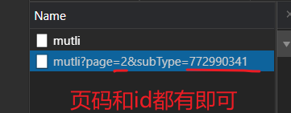

### 数据追加

```javascript
    async handleScrolltolower() {
      const currentData = this.recommendList[this.activeIndex];
      const { id } = currentData;
      let { page, pages } = currentData.goodsItems;
      //   console.log('id,page,pages -----> ', id, page, pages);
      if (page < pages) {
        page++;
        // this.getHomeRecommend({ subType: id, page });
        // 返回的数据自己需要自己加工
        const res = await getHomeRecommend(this.current.url, {
          subType: id,
          page,
        });
        // 先拿到返回的数据对应的 activeIndex 内容
        const resData = res.result.subTypes[this.activeIndex];
        // 旧的数据备份和追加
        const items = [
          ...currentData.goodsItems.items,
          ...resData.goodsItems.items,
        ];
        currentData.goodsItems.items = items;
        // 把分页等信息也同步过来
        currentData.goodsItems.page = resData.goodsItems.page;
        currentData.goodsItems.pages = resData.goodsItems.pages;
      }
    },
```

### 优化 - 节流

```javascript
/* 
  节流
  1. 通过 loading，判断当前是否有请求在发送
  2. if(loading) return
     否则 设置 loading 为 true,正常发送
  3. 请求回来后，把loading设置为false
*/
    async handleScrolltolower() {
      if (this.loading) return;
      const currentData = this.recommendList[this.activeIndex];
      const { id } = currentData;
      let { page, pages } = currentData.goodsItems;
      //   console.log('id,page,pages -----> ', id, page, pages);
      if (page < pages) {
        page++;
        this.loading = true;
        // this.getHomeRecommend({ subType: id, page });
        // 返回的数据自己需要自己加工
        const res = await getHomeRecommend(this.current.url, {
          subType: id,
          page,
        });
        // 先拿到返回的数据对应的 activeIndex 内容
        const resData = res.result.subTypes[this.activeIndex];
        // 旧的数据备份和追加
        const items = [
          ...currentData.goodsItems.items,
          ...resData.goodsItems.items,
        ];
        currentData.goodsItems.items = items;
        // 把分页等信息也同步过来
        currentData.goodsItems.page = resData.goodsItems.page;
        currentData.goodsItems.pages = resData.goodsItems.pages;
        this.loading = false;
      }
    },
```

### 优化 - 用户底部

```javascript
  <view
    class="loading"
    v-if="item.goodsItems.pages !== item.goodsItems.page"
    >正在加载...</view
  >
  <view class="loading" v-else>我也是有底线的</view>
```

### 分类-渲染一级分类

1.  样式，搜索框，左侧分类静态CV
2.  完成接口封装，发送请求，数据渲染

```javascript
// src\pages\category\index.vue
import { getCategoryTop } from "@/api/category";
export default {
  onLoad() {
    this.getCategoryTop();
  },
  methods: {
    async getCategoryTop() {
      const res = await getCategoryTop();
      this.categoryTop = res.result;
    },
  },
}
  
// src\api\category.js
import http from "@/utils/http";
export const getCategoryTop = () => {
  return http({
    url: "/category/top",
  });
};


```

### 分类-轮播图

1.  接口，在首页-广告区域，参数distributionSite 1为首页，2为分类商品页
2.  封装接口，页面调用，数据渲染

```javascript

    // src\pages\category\index.vue
    <view class="categories">
      <!-- 左侧分类 -->
      <scroll-view class="primary" scroll-y>
      </scroll-view>
      <!-- 右侧分类 -->
      <scroll-view class="secondary" scroll-y>
        <!-- 焦点图 -->
        <Carousel class="banner" height="200rpx" :banners="banners"></Carousel>
      </scroll-view>
    </view>
  import { getHomeBanner } from "@/api/home";
    
  data() {
    return {
      banners: [],
    };
  },
  onLoad() {
    // banner数据
    this.getHomeBanner();
  },
  methods: {
    async getHomeBanner() {
      const res = await getHomeBanner(2);
      this.banners = res.result;
    },
  },
```


### 二级分类渲染

1.  categorySubList 其实就是 当前的children，由categoryTop和activeIndex计算得到
2.  children作为二级分类标题渲染，children.goods作为二级分类商品渲染

```javascript
  computed: {
    categorySubList() {
      //   可选链操作符写法,保证返回的起码是一个数组
      return this.categoryTop?.[this.activeIndex]?.children || [];
    },
  },
```

### 我的模块

cv顶部背景，头像在顶部，引入胶囊安全区域，设置在paddingTop ，看到效果即可


### 我的模块其他模块

1.  个人资料要设置好 :style="{ paddingTop: capsule.bottom + 'px' }"
2.  其余按照文档cv，能够看到下面效果即可


### 使用小程序自带方法获取加密手机号

1.  静态结构cv
2.  定义方法，方法内可以拿到用户的加密手机号(个人开发者账号无法看到效果)

```javascript
  methods: {
    handleGetPhoneNumber(e) {
      // 返回用户的加密信息
      console.log("e -----> ", e);
    },
  },
```

### 通过wx.login获取用户code

1.  解释后台需要的code，是来源于 wx.login
2.  wx.login是微信自带的小程序用户凭证，只要是正常的用户，都能获取到code

```javascript
  async onLoad(options) {
    const [err, { code }] = await uni.login();
    if (!err) {
      this.code = code;
      console.log("code -----> ", code);
    }
  },
```

## day4

### 完成手机号登录

1.  把后端要的三个参数准备好
2.  在api/profile 封装请求
3.  发送请求，看到返回的数据

注意：个人号无法获取登录信息，所以看不到效果，先完成代码即可

```javascript
// src\api\profile.js
import http from "@/utils/http";
export const postLoginWxMin = (data) => {
  return http({
    url: "/login/wxMin",
    method: "POST",
    data,
  });
};

//  src\pages\login\index.vue
import { postLoginWxMin } from "@/api/profile";
export default {
  methods: {
    async handleGetPhoneNumber(e) {
      const { encryptedData, iv } = e.detail;
      const res = await postLoginWxMin({
        encryptedData,
        iv,
        code: this.code,
      });
      console.log("res -----> ", res);
    },
  },
  async onLoad(options) {
    const [err, { code }] = await uni.login();
    if (!err) {
      this.code = code;
      console.log("code -----> ", code);
    }
  },
};

```

### 手机号模拟登录 - 可以看到登录效果

1.  复制登录按钮，绑定事件即可
2.  找到文档，封装请求
3.  事件内发送请求，能看到返回数据即可

```javascript
// src\api\profile.js

/**
 * 小程序登录 - 测试
 * @param {string} phoneNumber 手机号
 */
export const postLoginWxMinSimple = (phoneNumber) => {
  return http({
    url: "/login/wxMin/simple",
    method: "POST",
    data: { phoneNumber },
  });
};

//  src\pages\login\index.vue
<button class="button phone" @click="postLoginWxMinSimple">
  <text class="icon icon-phone"></text>
  手机号快捷登录 - 测试
</button>

import { postLoginWxMin, postLoginWxMinSimple } from "@/api/profile";

methods: {
  async postLoginWxMinSimple() {
    const res = await postLoginWxMinSimple(15915876390);
    console.log("模拟登录 -----> ", res);
  },
},

```

### 将登陆移植到vuex

1.  loginWxMinSimple调用vuex中的actions
    1.  import { mapActions } from "vuex";
    2.  在method中 ...mapActions("user", \["postLoginWxMinSimple"]),
    3.  loginWxMinSimple 中 调用 this.postLoginWxMinSimple(15915876390)
2.  调用完进入到vuex - 不提供数据，直接cv
3.  记得在总模块中，把user注册进入
    1.  import user from "./user";
    2.  modules： {user}

```javascript
// 一共改三个文件 src\store\index.js，src\store\user.js，src\pages\login\index.vue
// src\store\index.js
import user from "./user";
modules： {user}

// src\store\user.js
import { postLoginWxMinSimple } from "@/api/profile";

export default {
  // 命名空间
  namespaced: true,
  state: {
    profile: null,
  },
  getters: {},
  mutations: {
    setProfile(state, payload) {
      console.log("payload -----> ", payload);
      state.profile = payload;
    },
  },
  actions: {
    // 手机号登录
    async postLoginWxMinSimple(store, payload) {
      const res = await postLoginWxMinSimple(payload);
      store.commit("setProfile", res.result);
    },
  },
};

// src\pages\login\index.vue
// 页面的方法名：postLoginWxMinSimple  —-  loginWxMinSimple
<button class="button phone" @click="loginWxMinSimple">

import { mapActions } from "vuex";

  methods: {
    /* 
        mapActions 语法
        1. mapActions(['方法名'])  --拿的是 根模块 的数据
        2. mapActions('模块名',['方法名'])  --拿的是 模块名 的数据
    */
    ...mapActions("user", ["postLoginWxMinSimple"]),
    async loginWxMinSimple() {
      // 不在页面直接调用了，在vuex中完成整个登录逻辑更好
      //   const res = await postLoginWxMinSimple(15915876393);
      //   直接调用 this.$store.dispatch('uesr/postLoginWxMinSimple',15915876393)
      this.postLoginWxMinSimple(15915876390);
    },
  },


```

### 登录成功-返回上一页，显示用户数据

1.  测试登录后，返回上一页
2.  我的页面使用模块数据 ...mapState('user',\['profile'])
3.  可以看到效果即可

```javascript
  // src\store\user.js
  actions: {
    // postLoginWxMinSimple 模拟登录
    async postLoginWxMinSimple(store, payload) {
      const res = await postLoginWxMinSimple(payload)
      console.log('模拟登录 -----> ', res.result);
      store.commit('setProfile', res.result)

      uni.showToast({ title: '登录成功' })
      // navigateBack 返回上一页，
      // 注意：如果是编译模式直接登录，会回不到上一页
      setTimeout(() => {
        uni.navigateBack()
      }, 1500);
    },
    // postLoginWxMin 真实登录
    async postLoginWxMin(store, payload) {
      const res = await postLoginWxMin(payload)
      console.log('真实登录 -----> ', res.result);
      store.commit('setProfile', res.result)

      uni.showToast({ title: '登录成功' })
      // navigateBack 返回上一页，
      // 注意：如果是编译模式直接登录，会回不到上一页
      setTimeout(() => {
        uni.navigateBack()
      }, 1500);
    },
  
 //src\pages\my\index.vue  
  computed: {
    ...mapState(["safeArea", "capsule"]),
    ...mapState("user", ["profile"]),
  },
```

### 修改个人信息静态结构-6

全程cv代码，介绍template代码，包括头像，表单即可，不用练习

### 获取个人信息-token处理 - 7

1.  个人信息不完整，需要发请求获取
2.  后端发现没有token，报401
3.  拦截器
    1.  请求拦截器：判断有没有token，有的就添加
    2.  响应拦截器：判断http返回码，目前401，跳转到登录页面 - 完成登录即可

```javascript
// src\api\profile.js
export const getMemberProfile = () => {
  return http({
    url: "/member/profile",
  });
};

// src\pages\my\profile.vue
<script>
import { getMemberProfile } from "@/api/profile";

export default {
  onLoad(options) {
    this.getMemberProfile();
  },
  methods: {
    async getMemberProfile() {
      const res = await getMemberProfile();
    },
  },
};
</script>


// src\utils\http.js
import store from "@/store";
const request = {
  invoke(args) {
    // 添加请求头
    args.header = {
      ...args.header, // 保留原本的 header
      "source-client": "miniapp", // 添加小程序端调用标识
      Authorization: store.state.user.profile?.token,
    };
  },
};
export default (options) => {
  return new Promise((resolve, reject) => {
    uni.request({
      ...options,
      success(res) {
        // 如果返回的状态码是 401，代表没登录，跳转登录页
        if (res.statusCode === 401) {
          uni.navigateTo({ url: "/pages/login/index" });
        }
    });
  });
};

```

### 修改个人信息页面 - onLoad 改成 onShow

主要就是介绍流程

1.  响应拦截器中，401状态码跳转到了登录页面
2.  登录成功后，执行 navigateBack，又回到了个人信息页面
3.  没有发送请求，修改 onLoad 改成 onShow
4.  onshow代表每次页面显示都会执行
5.  信息储存到memberProfile即可

### 修改个人信息 - 选择个人头像

1.  顶部安全区域，通过mapstate获取
2.  演示真实的上传图片，步骤总结1. wx.chooseMedia()拿到临时地址，2地址传递给后端
3.  过去使用 chooseImage，现在建议使用 chooseMedia

```javascript
// src\pages\my\profile.vue
<script>
import { getMemberProfile } from "@/api/profile";
import { mapState } from "vuex";

export default {
  computed: {
    ...mapState(["safeArea"]),
  },
  //   onLoad  ----  进入页面触发一次
  //   onShow  ----  每次看到页面都会触发
  onShow(options) {
    this.getMemberProfile();
  },
  methods: {
    // 选择用户头像
    async changeAvatar() {
      const [err, res] = await uni.chooseMedia({
        count: 1,
        mediaType: ["image"],
      });
      if (!err) {
        console.log("res -----> ", res.tempFiles[0].tempFilePath);
      }
    },
  },
};
</script>
```

### 修改个人信息 - 修改个人头像 - 13

1.  封装请求，注意不能使用 http请求，要使用 uni.uploadFile

```javascript
//src\api\profile.js
// 修改头像
export const postMemberProfileAvatar = (data) => {
  return uni.uploadFile({
    url: "/member/profile/avatar",
    filePath: data,
    name: "file",
  });
};
```

1.  页面发送请求，打印数据，是字符串，需要转化后使用

```javascript
// src\pages\my\profile.vue
const [err1, res1] = await postMemberProfileAvatar(
    res.tempFiles[0].tempFilePath
  );
  if (!err1) {
    const data = JSON.parse(res1.data);
    this.memberProfile.avatar = data.result.avatar;
  }
```

### 修改个人信息 - 昵称性别出生

1.  昵称性别职业-看到性别和日期即可，日期等会处理

```javascript
    genderChange(e) {
      // console.log("性别选择 -----> ", e);
      this.memberProfile.gender = e.detail.value;
    },
    handleBirthdayChange(e) {
      //   console.log('日期选择 -----> ', e);
      this.memberProfile.birthday = e.detail.value;
    },
```

### 使用dayjs完成日期格式化

1.  安装依赖  npm i dayjs
2.  页面引进和使用

```javascript
// src\pages\my\profile.vue
<picker  :end="end" >

import dayjs from "dayjs";

  data() {
    return {
      memberProfile: null,
      end: "",
    };
  },
  //   onLoad  ----  进入页面触发一次
  //   onShow  ----  每次看到页面都会触发
  onLoad() {
    console.log("dayjs() -----> ", dayjs().format("YYYY-MM-DD"));
    // dayjs()获取到当前的时间对象
    // dayjs().format("YYYY-MM-DD") 格式化 YYYY-MM-DD
    this.end = dayjs().format("YYYY-MM-DD");
  },
```

### 修改个人信息 - 地址选择

1.  绑定方法，打印e，看到返回的数据，有中文，有code
2.  code传递给后端，中文做页面展示

```javascript
    // 省市区
    handleFullLocationChange(e) {
      // console.log("e -----> ", e);
      const { code, value } = e.detail;
      // value 是前端展示的省市区
      this.memberProfile.fullLocation = value.join("");
      // code 是传递给后端的编码
      this.memberProfile.provinceCode = code[0];
      this.memberProfile.cityCode = code[1];
      this.memberProfile.countyCode = code[2];
    },
```

### 修改个人信息

1.  封装接口
2.  准备好传递给后台的数据
3.  调用接口
4.  用户反馈 - 提示信息和返回上一页
5.  修改信息后，我的页面不同步，下章节再讲

```javascript
//src\api\profile.js
export const putMemberProfile = (data) => {
  return http({
    url: "/member/profile",
    method: "put",
    data,
  });
};

// src\pages\my\profile.vue
// 保存用户信息
import { putMemberProfile } from "@/api/profile";

async handleSubmitForm() {
  const data = { ...this.memberProfile };
  // 如果后台不接收 id 、accout 等字段，那么我们需要主动删除
  // delete data.id
  const res = await putMemberProfile(data);
  // 用户提示
  uni.showToast({ title: "修改成功" });
  setTimeout(() => {
    uni.navigateBack();
  }, 1500);
},

```

### 我的页面同步信息

1.  我的页面-用户信息来源 vuex
2.  修改信息-用户信息来源自身memberProfile
3.  只需要在 memberProfile 修改时，也把 vuex 信息更新即可
    1.  vuex只需要两个字段 avatar，nickname
    2.  不能直接修改 vuex中的 state，所以要用 obj = {...vuex中的profile}
    3.  通过触发 mutations 修改即可
    ```javascript
    import { mapMutations, mapState } from "vuex";
    computed: {
      ...mapState(["safeArea"]),
      ...mapState("user", ["profile"]),
    },

    methods: {
      ...mapMutations("user", ["setProfile"]),
    }
    /* 
      用户修改完成后，同步修改vuex
      注意点
      1. 不能够直接修改 state 里面的数据，必须是 mutation 去修改
      2. 不同于小程序中的 setData({需要修改的属性})
    */
    //   this.$store.user.state.profile.avatar = this.memberProfile.avatar
    //   this.$store.user.state.profile.nickname = this.memberProfile.nickname
    const obj = {
      ...this.profile,
      avatar: this.memberProfile.avatar,
      nickname: this.memberProfile.nickname,
    };
    this.setProfile(obj);
    ```

### 账号管理-静态结构

1.  静态结构cv
2.  引入vuex中的profile，看到效果即可

### 地址管理-静态结构

1.  介绍功能，静态cv，数据分析

### 新建地址 - 静态结构和数据分析

1.  介绍功能，静态cv，数据分析

```vue
对着md文档复制
账号管理：src\pages\my\settings.vue - 注意需要自己引进 vuex 的 profile
地址管理：src\pages\my\address\index.vue
新建地址：src\pages\my\address\form.vue

```

### 新建地址完成 - 12

1.  封装接口
2.  准备好后台需要的数据
3.  发送请求，看到成功即可

```javascript
// src\api\address.js
import http from "@/utils/http";
export const postHomeAddress = (data) => {
  return http({
    url: "/member/address",
    method: "post",
    data,
  });
};

//src\pages\my\address\form.vue
import { postHomeAddress } from "@/api/address";
methods: {
  regionChange(e) {
    //   console.log('e -----> ', e);
    const { code, postcode, value } = e.detail;
    //   后台的省市区编码
    this.form.provinceCode = code[0];
    this.form.cityCode = code[1];
    this.form.countyCode = code[2];
    //   后台的邮编
    this.form.postalCode = postcode;

    //   前端页面省市区显示
    this.form.fullLocation = value.join('');
  },
  // 是否默认 - 1为是，0为否
  isDefaultChange(e) {
    //   console.log('e -----> ', e);
    this.form.isDefault = e.detail.value ? 1 : 0;
  },

  // 提交表单
  async submitForm() {
    const data = { ...this.form };
    const res = await postMemberAddress(data);
  },
},

```

### 收货地址列表渲染

1.  新增成功提示用户和返回上一页
2.  封装请求，发送请求
3.  注意使用 onShow，防止新增/修改时数据不同步

```javascript
// src\pages\my\address\form.vue  
async submitForm() {
  const obj = { ...this.form };
  console.log("obj -----> ", obj);
  const res = await postHomeAddress(obj);
  uni.showToast({ title: "新增成功" });
  setTimeout(() => {
    uni.navigateBack();
  }, 1500);
},

//src\api\address.js    
export const getMemberAddress = () => {
  return http({
    url: "/member/address",
  });
};

//src\pages\my\address\index.vue
import { getMemberAddress } from "@/api/address";
  async onShow() {
    const res = await getMemberAddress();
    this.addressList = res.result;
  },
  


```

## day5

### 收货地址修改

1.  都是同一个页面，但是地址修改会带上id，onLoad中获取
2.  修改标题 uni.setNavigationBarTitle({ title: "编辑地址" });
3.  根据id发请求，拿到数据保存到form，看到效果
    1.  返回的字段多了一个id，没影响，而且必须要留着传到后端，所以直接赋值
4.  根据id，调用接口是新建还是编辑 - 等会讲

```javascript
//src\api\address.js
/**
 * 查询收货地址详情
 */
export const getMemberAddressDetail = (id) => {
  return http({
    url: `/member/address/${id}`,
  });
};

// src\pages\my\address\form.vue
import { postHomeAddress, getMemberAddressDetail } from "@/api/address";
onLoad({ id }) {
  console.log("id -----> ", id);
  if (id) {
    // 编辑
    uni.setNavigationBarTitle({ title: "编辑地址" });
    this.id = id;
    this.getMemberAddressDetail();
  } else {
    // 新建
  }
},
methods: {
  async getMemberAddressDetail() {
    const res = await getMemberAddressDetail(this.id);
    this.form = res.result;
  },
}
```

编辑收货地址完成-10

1.  提交方法里，打印 this.form.id,说明编辑是有id，新建无id
2.  封装编辑地址接口
3.  根据id判断，调用哪个接口
    1.  注意编辑时，传递到后端的参数不需要id，所以要先删除再调用
    ```javascript
    //src\api\address.js
    export const putMemberAddressDetail = (id, data) => {
      return http({
        url: `/member/address/${id}`,
        method: "put",
        data,
      });
    };

    // src\pages\my\address\form.vue
    import {  putMemberAddressDetail } from "@/api/address";
     
    async submitForm() {
      if (this.form.id) {
        // 有id，代表编辑，调用编辑接口
        const obj = { ...this.form };
        // 真有后台不要的字段，记得删掉 delete obj.xxx
        // 因为后台不要id，建议删除 id
        delete obj.id;
        const res = await putMemberAddressDetail(this.form.id, obj);
        uni.showToast({ title: "编辑成功" });
      } else {
        // 没id，代表新增，调用新增接口
        const obj = { ...this.form };
        const res = await postHomeAddress(obj);
        uni.showToast({ title: "新增成功" });
      }
      setTimeout(() => {
        uni.navigateBack();
      }, 1500);
    },
    ```

### 删除收货地址

1.  查阅uni-swipe-action组件
2.  定义onAddressRemove方法，看到id
3.  const \[err, { confirm }] = await uni.showModal 弹出确认框
4.  删除后重新发送列表请求

```javascript
// src\pages\my\address\index.vue
  methods: {
    async onAddressRemove(id) {
      // console.log("id -----> ", id);
      const [err, { confirm }] = await uni.showModal({
        title: "删除",
        content: "您确定要删除吗?",
      });
      if (confirm) {
        // 删除业务
        const res = await deleteMemberAddressDetail(id);
        uni.showToast({ title: "删除成功" });
        const res1 = await getMemberAddress();
        this.addressList = res1.result;
      }
    },
  },
```

### 商品详情-介绍和页面静态结构

1.  介绍对着md文档大纲介绍详情页面，sku下节课讲
2.  静态结构cv
3.  介绍数据字段的作用
4.

### 自定义返回按钮

1.  原生的导航栏，带有返回按钮
2.  自定义的导航栏，没有返回按钮，需要自己封装

```javascript
  // src\components\GoBackBtn\GoBackBtn.vue
  methods: {
    onTap() {
      uni.navigateBack();
    },
  },
  
  // src\pages\goods\index.vue
  <!-- 返回按钮 -->
  <GoBackBtn></GoBackBtn>
```

### 获取商品详情数据

1.  封装接口
2.  页面调用
3.  数据保存

```javascript
//src\api\goods.js
import http from "@/utils/http";

/**
 * 商品详情
 */
export const getGoodsDetail = (id) => {
  return http({
    url: "/goods",
    data: { id },
  });
};

//src\pages\goods\index.vue
  onLoad({ id }) {
    this.id = id;
    this.getGoodsDetail();
  },
  methods: {
    async getGoodsDetail() {
      const res = await getGoodsDetail(this.id);
    },
  },
```

### 轮播图&#x20;

1.  右下角指示器是自己写的，需要通过 current 控制
2.  谁来控制？轮播图的@change事件
3.  文档静态cv即可

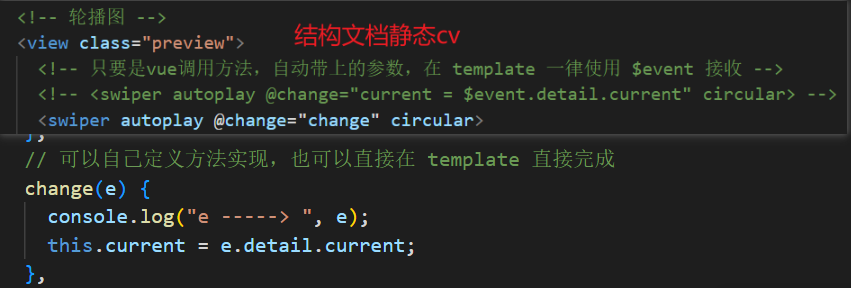

### 规格参数

1.  代码静态cv，名称和价格纯cv，介绍一下即可
2.  规格参数cv，文字目前是写死的，但是重点注意都绑定了事件，与弹出层相关，在介绍sku部分再细说
3.  介绍selectArrText是规格文本，在项目小程序上演示选择效果
4.  强调目前事件，变量都不需要管，先看到效果即可

### 商品评价、商品详情、常见问题&#x20;

1.  商品评价纯静态cv
2.  商品详情，介绍
    1.  属性遍历v-for="item in goods.details.properties"
    2.  商品图片遍历v-for="(item, index) in goods.details.pictures"
3.  常见问题，介绍办法是弹出窗，等会一并讲解

### 商品详情整页面cv


### 商品详情-相关推荐和用户操作

1.  封装请求
2.  onLoad中直接发送
3.  相关推荐和用户操作的静态结构cv

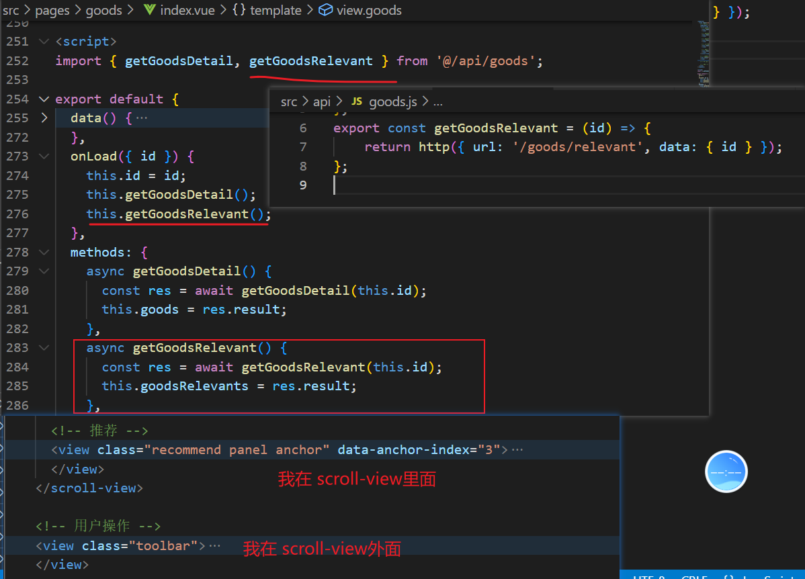

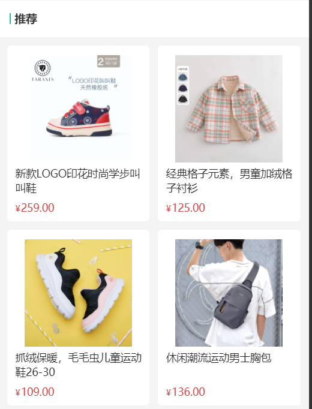

### 商品详情-弹出层-对应4个小组件

1.  用户操作静态cv
2.  弹出窗内容，就是4个小组件，分别复制代码到相应组件
3.  怎么确定弹出的是什么内容? showHalfDialog 传递组件名
4.  定义方法，调用，看到打印的组件名字即可

```javascript
    // src\pages\goods\index.vue
    // 复制4个组件，定义方法
    // 4个弹出层的方法
    showHalfDialog(name) {
      console.log("name -----> ", name);
    },
```

### 弹出层实现

1.  打开uniapp官网，找到uni-popup，通过this.\$refs.popup.open()打开,this.\$refs.popup.close()关闭

    [https://uniapp.dcloud.net.cn/component/uniui/uni-popup.html](https://uniapp.dcloud.net.cn/component/uniui/uni-popup.html "https://uniapp.dcloud.net.cn/component/uniui/uni-popup.html")
2.  popup里面引入4个组件，通过v-show="layer === '组件名'"确定显示
    ```javascript
    // 页面记得引进4个组件，注意代码判断用的是小写
    <uni-popup ref="popup" type="bottom" background-color="#fff">
      <view class="popup-root">
        <text @click="hideHalfDialog" class="close icon-close"></text>
        <!-- 4个组件，注意代码判断用的是小写 -->
        <Sku v-show="layer === 'sku'"></Sku>
        <Shipment v-show="layer === 'shipment'"></Shipment>
        <Clause v-show="layer === 'clause'"></Clause>
        <Helps v-show="layer === 'helps'"></Helps>
      </view>
    </uni-popup>
          
    showHalfDialog(name) {
      // 1. 显示uni-pop弹出层
      this.$refs.popup.open("bottom");
      // 2. 弹出层里面，显示某一个组件即可
      this.layer = name;
    },

    hideHalfDialog() {
      this.$refs.popup.close();
    },

    ```

### sku概念-最小库存单位

1.  距离想买一台苹果手机，商店无法发货
2.  文档介绍，然后打开京东，找到苹果
3.  要把具体的内存，颜色，套装等都确定了，才能是一个确定的sku

### sku算法了解 - 2018阿里面试题 - 原理讲出来就可以进阿里了

1.  后端会返回规则参数数据，和sku数据
2.  对着文档介绍黑色有所有的尺码，但是杏色只有38，怎么做到这个功能？遍历
3.  但是如果还有其他的规格要处理，依靠遍历就无法实现了
4.  打开掘进，介绍算法相关
5.  总结，不用自己写，反正也写不出来，使用插件

### sku插件下载和引用

1.  打开uniapp官网-插件-跳转插件市场，搜索sku即可
2.  下载

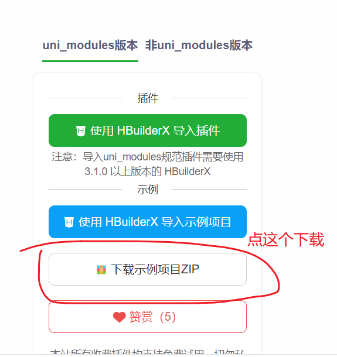


### sku关键属性介绍

1.  在uniapp上的官网了解sku插件使用
2.  把页面代码复制
3.  了解属性即可

```javascript
    <!-- SKU -->
    <vk-data-goods-sku-popup
      v-model="isShowSku"
      :mode="skuMode"
      :localdata="goodsSku"
      ref="skuRef"
      @add-cart="onAddCart"
      @buy-now="onBuyNow"
    />
```

### sku复制官网demo看效果

1.  在uniapp插件官网上，复制demo
2.  页面上在 getGoodsDetail 数据回来后，放到 this.goodsSku = '复制到的demo数据'
    1.  sku\_list，有库存的商品，所以用户可以选择
    2.  spec\_list - 所有的规格数组
3.  绑定事件，点击时候看到效果即可

```javascript
    async getGoodsDetail() {
      const res = await getGoodsDetail(this.id);
      this.goods = res.result;
      //   goodsSku数据应该来源于后台返回的数据，因为现在我也不知道数据怎么用，先用官网demo，看效果
      this.goodsSku = '复制到的demo数据'
    }
    
    // 显示sku插件
    openSkuPopup() {
      this.isShowSku = true;
    },
```


### 官网demo数据和后台数据一一对应

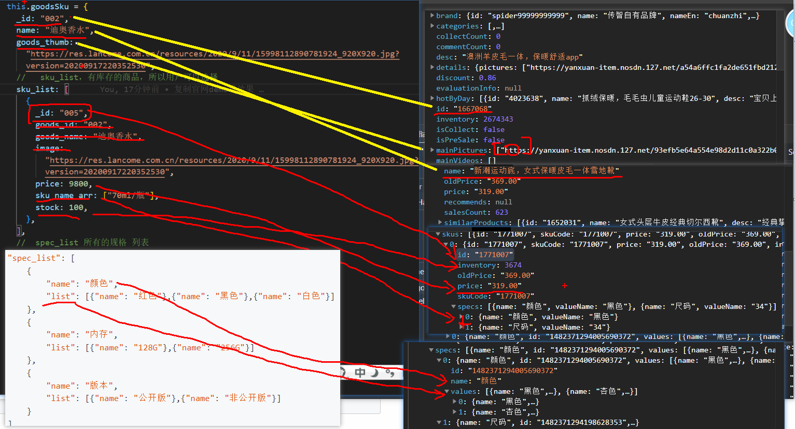

### 根据官网文档，把后台数据处理成合适的数据

```javascript
this.goodsSku = {
    _id: this.goods.id,
    name: this.goods.name,
    goods_thumb: this.goods.mainPictures[0],
    //  sku_list - 用户可以选择的sku数组
    sku_list: this.goods.skus.map((v) => ({
        // 商品的skuId
        _id: v.id,
        // 商品id
        goods_id: this.goods.id,
        // 商品名
        goods_name: this.goods.name,
        // 商品主图
        image: this.goods.mainPictures[0],
        // sku对应的价格
        price: v.price,
        // sku对应的规格名，如果不对，那就返回 vv.name
        sku_name_arr: v.specs.map((vv) => vv.valueName),
        // sku对应的库存
        stock: v.inventory,
    })),
    // spec_list - 所有的规格数组
    spec_list: this.goods.specs.map((v) => ({
        // 规格名字对应的可选值
        list: v.values.map((vv) => ({ name: vv.name })),
        // 规格名字，颜色，尺寸，内存等
        name: v.name,
    })),
}
```

### 完善商品sku的三个小功能

1.  价格，建议使用:amount-type='0'，也可以\*100
2.  openSkuPopup 设置 skuMode - 1:都显示 2:只显示购物车 3:只显示立即购买
3.  在sku中的关闭事件，设置好 this.selectArrText

```javascript
  <!-- SKU -->
  <vk-data-goods-sku-popup
    v-model="isShowSku"
    :mode="skuMode"
    :localdata="goodsSku"
    :amount-type="0"
    ref="skuRef"
    @add-cart="onAddCart"
    @buy-now="onBuyNow"
    @close="onClose"
  />
  
  data() {
    //   选中的文本回显
    selectArrText: '',
  };  
    
  methods:{
      // 显示sku插件
    openSkuPopup(num) {
      this.isShowSku = true;
      // 把传过来的类型设置到 skuMode,1:都显示 2:只显示购物车 3:只显示立即购买
      this.skuMode = num;
    },
    
    // amount-type="0"：设置单位为元
    // :mode="skuMode"：设置模式 1:都显示 2:只显示购物车 3:只显示立即购买
    /* 
    组件关闭时，把选中的内容回显
    为什么不写在computed，因为页面还没渲染完就会执行
    这时候 this.$refs.skuRef 拿不到内容，执行后面的代码就会报错
    所以写在方法里面更合适
    */
    onClose() {
      this.selectArrText = this.$refs.skuRef.selectArr.join(' ').trim();
    },
  }
```

### 加入购物车

1.  封装接口
2.  页面调用，传递参数，参数需要 {skuId, count}即可
3.  用户提示

```javascript
//src\api\cart.js
import http from '@/utils/http';
export const postMemberCart = (data) => {
    return http({ url: '/member/cart', method: 'post', data });
};

// 加入购物车，会带上已选择好的sku商品
import { postMemberCart } from '@/api/cart';

  async onAddCart(e) {
    //   console.log("e -----> ", e);
    const res = await postMemberCart({ skuId: e._id, count: e.buy_num });
    uni.showToast({ title: '加入购物车成功' });
  },
```

## day6

### 对象解构和重命名

1.  对参数e可以直接解构
2.  解构时可以使用 : 重命名

```javascript
// 解构使用，和重命名
    async onAddCart({  _id: skuId, buy_num: count }) {
      //   console.log("e -----> ", e);
      const res = await postMemberCart({ skuId, count });
      uni.showToast({ title: "加购成功" });
      this.isShowSku = false;
    },
```

### 跳转购物车 - 跳转tabbar 使用 switchTab

```javascript
// src\pages\goods\index.vue
// 跳转购物车 - 使用switchTab
    goCart() {
      uni.switchTab({ url: "/pages/cart/index" });
    },
```

### 购物车列表和登录状态

1.  静态文档cv，包括 "状态提示" 都复制
2.  获取购物车列表

```javascript
//src\pages\cart\index.vue
import { getMemberCart } from "@/api/cart";

onShow() {
  this.getMemberCart();
},
methods: {
  async getMemberCart() {
    const res = await getMemberCart();
    this.carts = res.result;
  },
},
```

### 未登录状态下会跳转登录页的处理

1.  引进用户状态
2.  已登录的情况下才发送请求
3.  对着md文档复制静态结构 - 购物车列表和状态提示

```javascript
// 静态结构自己cv 
import { mapState } from "vuex";

export default {
  computed: {
    ...mapState('user', ['profile']),
  }
  methods:{
    onShow() {
      if (this.profile?.token) {
        this.getMemberCart();
      }
    },
  }
}
```

### 商品状态的修改

1.  获取到要修改的skuId
2.  获取到改变后的状态
3.  封装接口，发送请求
4.  数据改变后，页面更新
    1.  重新发送购物车列表请求 - 简单点，建议使用
    2.  修改data购物车的数据

```javascript
//src\api\cart.js
export const putMemberCart = (skuId, data) => {
  return http({
    url: `/member/cart/${skuId}`,
    method: "PUT",
    data,
  });
};
    
  //src\pages\cart\index.vue
  @tap.stop="changeSelected(item.skuId, item.selected)"
  
  import { getMemberCart, putMemberCart } from "@/api/cart";
  async changeSelected(skuId, selected) {
    // console.log("skuId, -----> ", skuId, selected);
    // 点击完，状态得改变，所以取反就是改变后的状态
    selected = !selected;
    const res = await putMemberCart(skuId, { selected });
    this.getMemberCart();
  },
```

### 商品数量的修改

1.  获取到要修改的skuId
2.  获取到改变后的数量 - changeCount(skuId, num, count, stock)
    1.  最小不能小于1
    2.  最大不能超过库存
3.  封装接口，发送请求
4.  数据改变后，页面更新

```javascript
// 增加和减少的 都要改
@tap="changeCount(item.skuId, -1, item.count, item.stock)"
@tap="changeCount(item.skuId, 1, item.count, item.stock)"
    
async changeCount(skuId, num, count, stock) {
  console.log("skuId, num,count,stock -----> ", skuId, num, count, stock);
  count += num
  if (count  < 1) {
    return uni.showToast({ title: "最少购买1个", icon: "none" });
  } else if (count > stock) {
    return uni.showToast({ title: `不能超过库存 ${stock}`, icon: "none" });
  }

  const res = await putMemberCart(skuId, { count });
  this.getMemberCart();
},
```

### 使用uniapp内置组件完成数量修改&#x20;

```javascript
<!-- 商品数量，阻止冒泡 -->
<view class="quantity" @tap.stop="() => {}">
  <!-- $event代表当前函数调用的附带参数 -->
  <uni-number-box
    v-model="item.count"
    :min="1"
    :max="item.stock"
    @change="bindChange(item.skuId, $event)"
  ></uni-number-box>
</view>

async bindChange(skuId, count) {
  console.log("skuId,count -----> ", skuId, count);
  const res = await putMemberCart(skuId, { count });
  this.getMemberCart();
},
```

### 勾选商品的总数量和总价格&#x20;

1.  代码forEach完成即可

```javascript
    
    // 勾选了的购物车数组
    selectedCarts() {
      return this.carts.filter((v) => v.selected);
    },
    
    // 勾选的商品数量
    selectedCartsCount() {
      let sum = 0;
      this.selectedCarts.forEach((v) => {
        sum += v.count;
      });
      return sum;
    },
    // 勾选的商品总价
    selectedCartsPrice() {
      let sum = 0;
      this.selectedCarts.forEach((v) => {
        sum += v.price * v.count;
      });
      return sum;
    },
```

### 计算全选状态

1.  购物车的数量 === 选中的数量
2.  使用every对购物车做遍历判断

```javascript
computed: {
   // 是否全选
  /* 
      1. 选中的商品数量 === 购物车的数量
      2. 购物车中，每一条数据都选中了，那么我就全选的状态
          every 检测数组中的 每一项，都符合条件，那么就返回 true
          注意：对于空数组，every会直接返回 ture，所以要做兼容处理
          some 检测数组中的 某一项，只要有一项符合条件，那么就返回true
          注意：对于空数组，some会直接返回 false，所以要做兼容处理
  */
  isSelectedAll() {
    //   return this.selectedCarts.length === this.carts.length;
    return this.carts.length > 0 && this.carts.every((v) => v.selected);
  },
}
```

### 全选和反选&#x20;

1.  封装和介绍接口
2.  定义方法，方法里面获取到修改后的状态
3.  修改后的状态，等于当前全选按钮的状态，取反

```javascript
// src\api\cart.js
/**
 * 购物车全选/取消全选 { selected: true },不传ids默认整个购物车修改
 */
export const putMemberCartSelected = (data) => {
  return http({
    url: `/member/cart/selected`,
    method: "PUT",
    data,
  });
};
  
// src\pages\cart\index.vue
import {  putMemberCartSelected } from "@/api/cart";
async changeSelectedAll() {
  // 修改后的状态，等于当前全选按钮的状态，取反
  let selected = !this.isSelectedAll;
  const res = await putMemberCartSelected({ selected });
  this.getMemberCart();
},
```

### 删除商品&#x20;

1.  封装和介绍接口
2.  添加上删除确认框
3.  接口调用

```javascript
// src\api\cart.js
/**
 * 删除购物车 { ids: [skuId1,skuId2] }
 */
export const deleteMemberCart = (data) => {
  return http({
    url: `/member/cart`,
    method: "delete",
    data,
  });
};

// src\pages\cart\index.vue
// 删除购物车商品
    async deleteCart(skuId) {
      // 删除建议做用户确认
      const [err, { confirm }] = await uni.showModal({
        title: "删除",
        content: "您确定要删除吗?",
      });
      if (confirm) {
        // 删除业务
        const res = await deleteMemberCart({ ids: [skuId] });
        this.getMemberCart();
      }
    },
```

### 批量删除商品


### 跳转订单页

1.  静态代码，禁用仅仅是样式，其实还是可以点击
2.  定义方法，方法内也要判断是否有选中商品
3.  跳转页面

```javascript
// 去结算按钮
goToOrderCreate() {
  if (this.selectedCartsCount === 0) {
    uni.showToast({ title: "请至少选中一个商品", icon: "none" });
  } else {
    uni.navigateTo({ url: "/pages/order/create/index" });
  }
},
```

### 预付单 - 发送请求拿回数据

1.  静态结构CV
2.  发送请求，拿回数据

### 订单 - 获取收货地址，存放到vuex-13

1.  准备好 address 的全局数据，state和setSelectedAddress方法
2.  store/index.js  引进和使用模块
3.  创建订单页面，引进 selectedAddress 数据
4.  在地址管理页面，点击某一条地址，把地址存放到vuex中
5.  优化- 选择完地址后，后退到上一页即可

```javascript
// src\store\address.js
export default {
  state: {
    selectedAddress: null,
  },
  mutations: {
    setSelectedAddress(state, payload) {
      state.selectedAddress = payload;
    },
  },
};

//src\store\index.js
import address from "./address";
modules: {
  user,
  address,
},

//src\pages\order\create\index.vue
<script>
import { mapState } from "vuex";
export default {
  computed: {
    ...mapState("address", ["selectedAddress"]),
  },
};
</script>

//src\pages\my\address\index.vue
<view class="item" @click="addressClick(item)">
import { mapMutations } from "vuex";

  methods: {
    ...mapMutations("address", ["setSelectedAddress"]),
    // 点击某一条收货地址，存到全局的 vuex中
    addressClick(item) {
      console.log("item -----> ", item);
      this.setSelectedAddress(item);
      // 选择完，直接后退
      uni.navigateBack();
    },
  },

```

### 地址选择-返回上一页的优化

1.  了解业务场景
2.  阻止点击冒泡
3.  返回上一页优化

```javascript
<!-- 🐛 添加阻止冒泡 -->
<navigator
  :url="`./form?id=${item.id}`"
  class="edit"
  hover-class="none"
  @tap.stop="() => {}"
>
  修改
</navigator>

// 点击某一条收货地址，存到全局的 vuex中
addressClick(item) {
  console.log("item -----> ", item);
  this.setSelectedAddress(item);
  // 选择完，直接后退 - 太直接不好
  // 如果从订单页过来会带参数 from=order ，后退
  // 否则不需要后退

  // getCurrentPages 获取到访问记录的数组
  const pages = getCurrentPages();
  const currentPage = pages[pages.length - 1];
  const { from } = currentPage.options;
  if (from === "order") {
    uni.navigateBack();
  }
},

```

### 创建预付单

1.  封装接口
2.  字段分析
3.  定义方法，调用接口
    1.  判断是否有收货地址
    2.  收集后端需要的数据
    3.  调用接口
    4.  看到效果即可，订单创建完后，再留在页面会报错，先不管

```javascript
// src\api\order.js
export const postMemberOrder = (data) => {
  return http({
    url: "/member/order",
    method: "POST",
    data,
  });
};
    
// src\pages\order\create\index.vue
import { getMemberOrderPre, postMemberOrder } from "@/api/order";
/* 
    1. 封装请求
    2. 收集后台的数据
    3. 优化 - 判断是否有收货地址
*/
async submitForm() {
  if (!this.selectedAddress.id) {
    return uni.showToast({ title: "请先选择收货地址", icon: "none" });
  }
  const data = {
    goods: this.orderPre.goods.map((v) => ({
      count: v.count,
      skuId: v.skuId,
    })),
    addressId: this.selectedAddress.id,
    deliveryTimeType: 1,
    payType: 1,
    payChannel: 1,
    buyerMessage: this.buyerMessage,
  };
  console.log("data -----> ", data);
  const res = await postMemberOrder(data);
},
```

### 跳转订单详情页-带上orderId

1.  创建完订单后，购物车已选商品全部消费掉，所以留在页面会报错
2.  订单创建完后，跳转订单详情页-带上orderId

```javascript
    async submitForm() {
      // 其余已省略
      uni.showToast({ title: "创建订单成功" });
      uni.navigateTo({ url: `/pages/order/detail?orderId=${res.result.id}` });
    },
```

### 购物车立即下单跳转预付单-8

1.  点击立即购买，跳转预付单页面，单上 skuId 和 count
2.  预付单页面接收，有skuId 就调用立即下单接口


### 订单-顶部导航栏-获取设备平台

1.  复制文档静态结构
2.  vuex中获取设备平台，platform: uni.getSystemInfoSync().platform,
3.  页面引入使用

```javascript
  //src\store\index.js
  state: {
    // 导航栏的安全区域
    safeArea: uni.getWindowInfo().safeArea,
    // 胶囊的安全区域
    capsule: uni.getMenuButtonBoundingClientRect(),
    // 获取设备平台 - getSystemInfoSync 同步获取，不建议使用 getSystemInfo 异步获取
    platform: uni.getSystemInfoSync().platform,
  },
  
  // src\pages\order\detail.vue
    computed: {
    ...mapState(["safeArea", "platform"]),
  },
```

### 获取订单详情

1.  封装请求
2.  在上个页面拿到id，发送请求
3.  看到数据回来即可

### 订单状态渲染

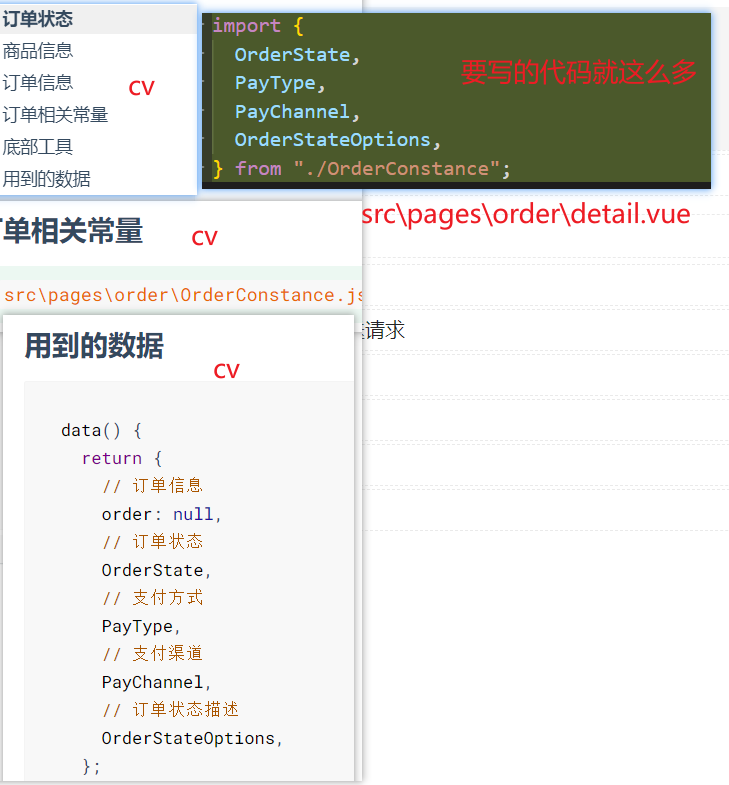


### 时间格式化

```javascript
countdown() {
    if (this.order) {
        return dayjs.unix(this.order.countdown).format("mm分ss秒");
      } else {
        return "00分00秒";
      }
},
```

### 倒计时

&#x20;   判断倒计时 this.order.countdown
&#x20;   1\. 条件，开启定时器
&#x20;   2\. 倒计时内递减，到0时，需要清理定时器，修改订单状态为已取消
&#x20;   3\. 优化-离开页面时清理定时器

```javascript
  async onLoad({ id }) {
    // 不建议使用异步获取 - 1626549626700042242
    // const res = await uni.getSystemInfo();
    // console.log("res -----> ", res.platform);
    id = "1626558390752776193";
    const res = await getMemberOrderDetail(id);
    this.order = res.result;
    /* 
    判断倒计时 this.order.countdown
    1. 满足条件，开启定时器
    2. 倒计时内递减，到0时，需要清理定时器，修改订单状态为已取消
    3. 优化-离开页面时清理定时器
    */
    // this.order.countdown = 5;
    this.timer = null;
    if (this.order.countdown > 0) {
      this.timer = setInterval(() => {
        this.order.countdown--;
        if (this.order.countdown === 0) {
          clearInterval(this.timer);
          this.order.orderState = OrderState.YiQuXiao;
        }
      }, 1000);
    }
  },
  // 离开的生命周期，清理定时器
  onUnload() {
    clearInterval(this.timer);
  },
```

### 支付功能实现

1.  调用后端接口，后台生成订单，返回微信支付所需参数
2.  调用 `uni.requestPayment`  调起微信支付
3.  支付成功，弹出提示，跳转到支付成功页面 `/pages/order/payment`
4.  支付失败，跳转到订单列表页面  `/pages/order/index`

```javascript
  methods: {
    /* 
    支付流程
    1. 调用后端接口，后台生成订单，返回微信支付所需参数
    2. 调用 `uni.requestPayment`  调起微信支付
    3. 支付成功，弹出提示，跳转到支付成功页面 `/pages/order/payment`
    4. 支付失败，跳转到订单列表页面  `/pages/order/index`
     */
    async orderPay() {
      const res = await getPayWxPayMiniPay(this.order.id);
      console.log("res -----> ", res);
      const [err, result] = await uni.requestPayment(res.result);
      if (!err) {
        uni.showToast({ title: "支付成功", icon: "success" });
      } else {
        uni.showToast({ title: "支付失败", icon: "error" });
      }
    },
  },
```

### 订单状态，订单列表在md文档复制完成&#x20;

## 扩展

### uniapp - hbuildx

### 新建项目

1.  打开hbuildx ，左上角 文件 - 项目 - 新建
2.  输入名称，选择模板(可以选择空模板)，vue版本，不使用uniCloud

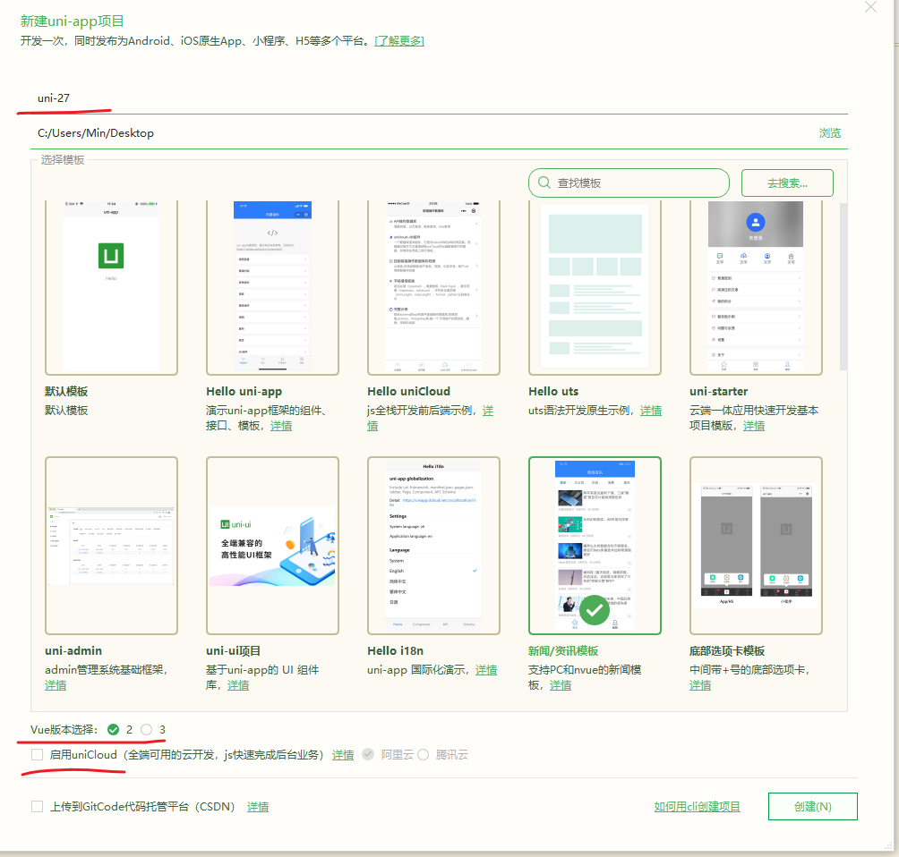

### 运行项目


### 运行时可能出现的问题

1.  项目所需要的依赖下载太慢(教室肯定慢，耐心)
2.  运行时打不开 谷歌，开发者工具，模拟器等，需要自行配置

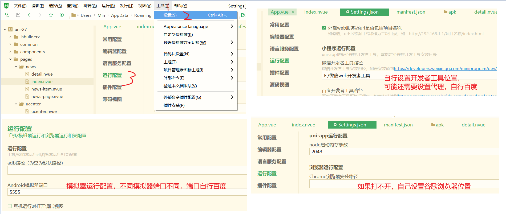

### 打包项目

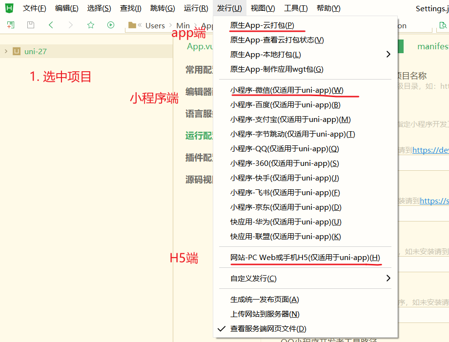

### 打包可能出现的问题

1.  需要注册和登录 hbuildx
2.  小程序(填写appid)和h5 应该没问题，打包后路径在 hbuildx 看控制台


1.  云打包app会比较耗费时间
    1.  android包名自动生成(按提示来也行)
    2.  可能需要配置app的图标
        
    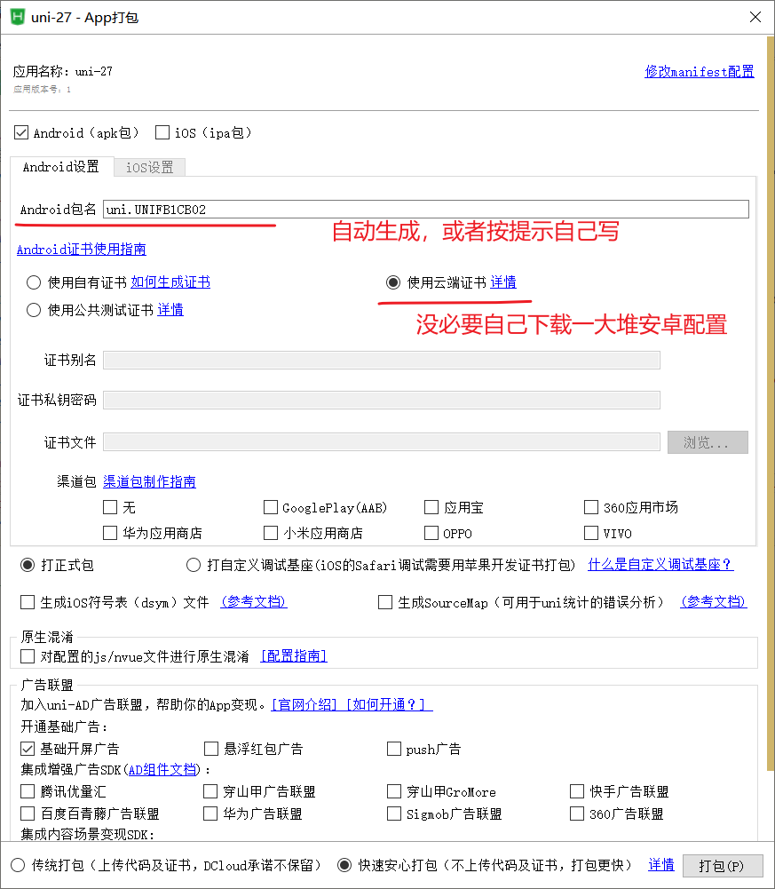
